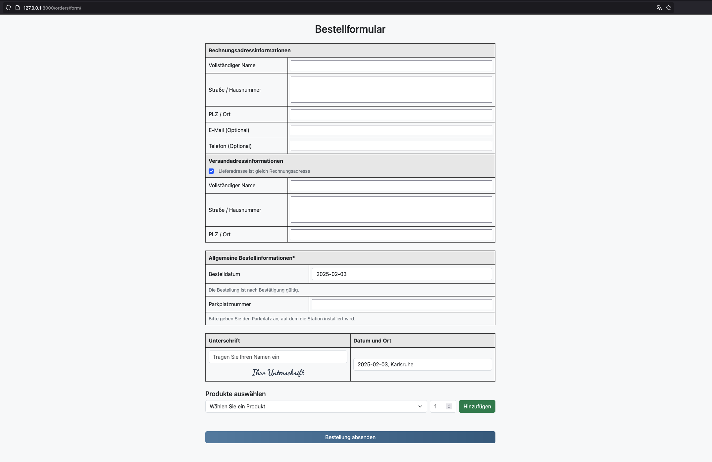

# demo task repository
Chargetic's order form


**Running the Project**

1️⃣ Create .env
```
cp .env.local .env
```

2️⃣ Start Docker
```
docker-compose up --build
```

3️⃣ Apply Migrations and superuser
```
docker exec -it charge_django bash
```
```
python manage.py makemigrations
```
```
python manage.py migrate
```
```
python manage.py createsuperuser
```
```
python manage.py seed_products
```


1. Scalability and Maintainability

    - The separation of concerns between Order, OrderItem, and Product ensures that the database is normalized (avoiding data redundancy).
    - The 1:N relationships efficiently handle multiple products in an order without repeating product details, making it scalable for large datasets.

Example:
Instead of storing product details inside each order, we reference products using foreign keys. This keeps data consistent and reduces duplication.
2. Data Integrity and Consistency

    - The use of Foreign Keys (FKs) ensures referential integrity.
        Example: You can't create an OrderItem without a valid Order or Product.
    - The on_delete=models.PROTECT in OrderItem prevents accidental deletion of referenced products.


    We prevent orphaned records (e.g., an order referring to a deleted product).
    Ensures business rules are enforced at the database level.

3. Flexibility for Future Expansion

This approach makes it easy to extend the database while maintaining backward compatibility:

- Adding a Payment System: The Payment model allows tracking payments separately, making it easy to integrate multiple payment gateways (e.g., PayPal, Stripe).
- Handling Notifications: The Notification model enables user alerts (e.g., order confirmation emails, status updates).
- Performance Optimization: Indexes on Foreign Keys to ensure efficient querying + Preload Related Data in Dkango ORM helps reduce queries.

4. Business Logic Safety

    - Ensuring Data Completeness: The form validation prevents missing fields like billing address before submission.
    - Product Price Calculation at Order Level: Instead of relying on user input, product prices are fetched from the database, avoiding manipulation risks.


